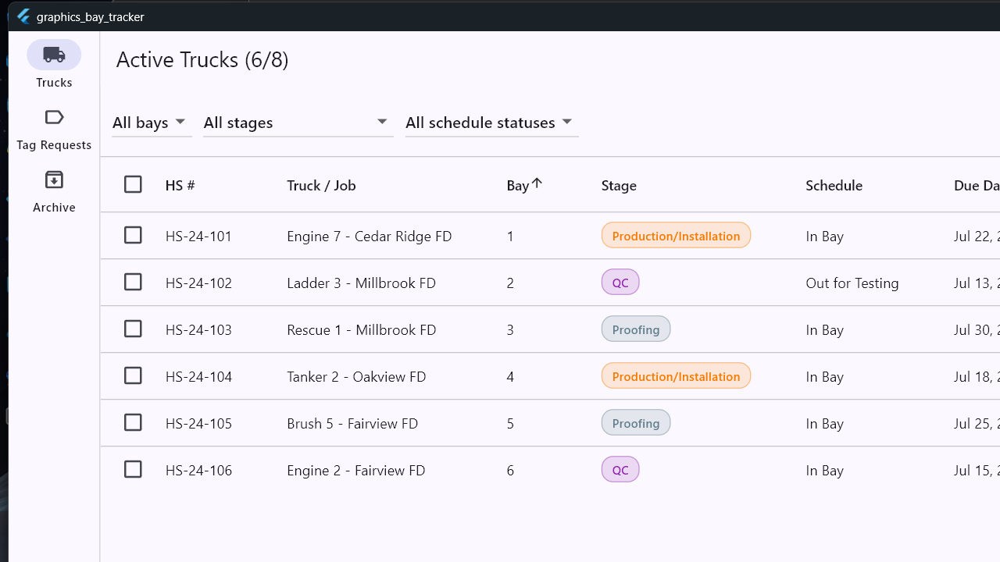
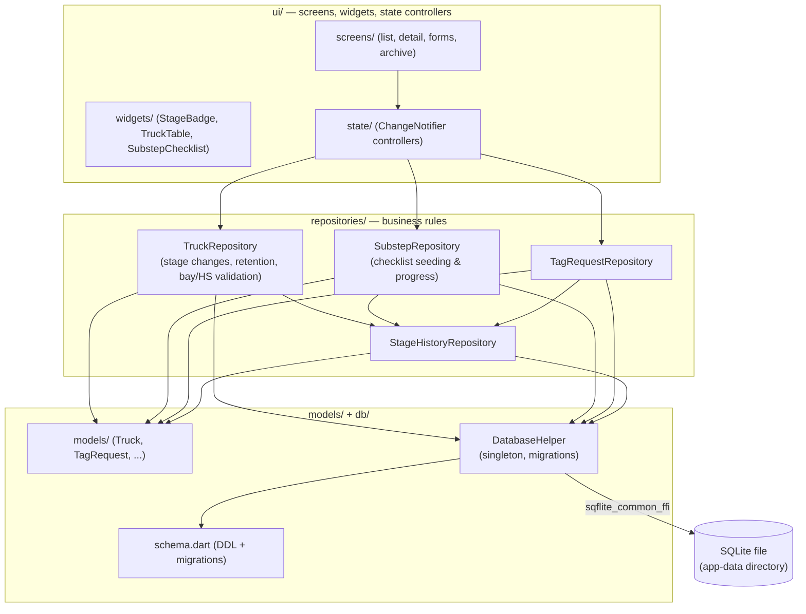
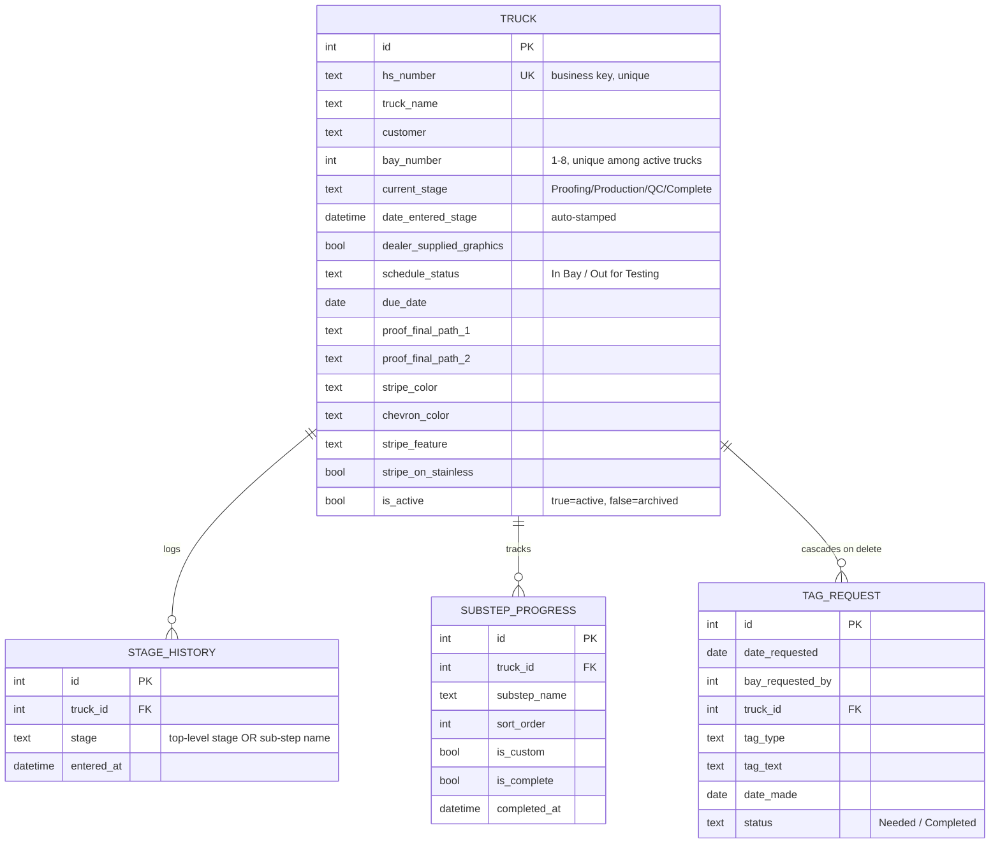

# Graphics Department Tracking Tool ("Bay Tracker")

A single-user application — called **Bay Tracker** — that tracks fire truck graphics jobs as they move through an 8-bay production shop — from design proofing, through striping/lettering/chevron installation, through QC, to completion. It replaced an informal Trello-and-memory process with a real, structured system that has an actual data model, automatic history logging, and enforced business rules.

Built with **Flutter** and a local **SQLite** database, running natively on both **Windows desktop** and **Android** (used on a tablet on the shop floor). No server, no login, no cloud dependency — it's a purpose-built tool for one person's daily workflow.



## Download & install

**Windows:** grab the latest installer from **[Releases](../../releases/latest)** — `BayTrackerSetup.exe`. It's a standard Windows installer (built with Inno Setup):

- Installs per-user (no admin rights required, no UAC prompt)
- Creates a Start Menu shortcut and an optional desktop shortcut
- Registers a normal uninstaller in Windows' "Add or Remove Programs"
- On first launch, the app creates its own SQLite database automatically — there's nothing to configure, no server to point at, no separate setup step

**Android:** grab `app-release.apk` from the same [Releases](../../releases/latest) page and sideload it (enable "install from unknown sources" for whichever app you use to open it), or install directly over USB with `adb install app-release.apk`.

## Why this exists

A small graphics shop runs every fire truck through the same pipeline: **Proofing → Production/Installation → QC → Complete**, occupying one of 8 physical bays at a time. On top of the main pipeline, installers file ad-hoc requests for compartment labels and tags throughout the process. None of this was tracked in one place — there was no record of how long a truck sat in a given stage, no structured checklist for the striping/lettering sub-steps, and no way to search for "what does HS-24-118 need done."

This app models that real workflow directly: stages, sub-steps, schedule status, tag requests, and a retention policy that mirrors how the shop actually operates (8 active trucks + the 8 most recently completed, nothing older kept around).

## Features

- **A real Material 3 theme, not defaults** — custom light/dark color scheme (follows the Windows system setting), themed data tables, cards, inputs, and buttons, a native-feeling font (Segoe UI), and smooth cross-fade page transitions — see [`app_theme.dart`](lib/ui/theme/app_theme.dart)
- **Active truck list** — sortable/filterable by bay, stage, schedule status (In Bay / Out for Testing), and due date
- **Truck detail view** — stage control (forward *and* backward, with a confirmation gate before archiving), schedule status, and a live Production/Installation checklist
- **Completion progress ring** — a green/red ring (list view and detail view) showing how far along a truck is: Proofing is worth a flat 20%, the remaining 80% is earned by checking off Production/Installation sub-steps, and QC intentionally adds nothing of its own — it just carries forward whatever the checklist already earned. See [`truck_progress.dart`](lib/utils/truck_progress.dart).
- **Production/Installation checklist** — the 9 standard sub-steps (Cab Striping, Cab Lettering, Bumper Chevron, Hydraulic Area Striping, Passenger/Driver Body Striping & Lettering, Rear Body Graphics and Chevron, Ladder Signs, Ladder Tip), plus the ability to add one-off custom sub-steps per truck. Automatically skipped for dealer-supplied graphics jobs.
- **Graphics specification** — Stripe Color, Chevron Color, and Stripe Feature, each a fixed option set with a "Custom" free-text fallback, plus a Stripe-on-Stainless flag
- **Final proof PDFs** — attach the 2 required customer-approved proofs per truck and open them in the system's default PDF viewer directly from the app
- **Tag/label requests** — a lighter-weight, independent queue for ad-hoc installer requests, filterable by status and requesting bay
- **Archive** — read-only view of the 8 most recently completed trucks
- **Automatic history logging** — every stage change (and every sub-step completion) is timestamped and logged in the background, even though there's no timeline UI yet — the data is there for a future view
- **Rolling retention** — completing a truck archives it automatically; once more than 8 trucks are archived, the oldest is permanently deleted, keeping the working set exactly matched to the physical shop (8 bays + 8 most recent)

## Screenshots

| Active Trucks |
|---|
|  |

*(More views — truck detail, the Production/Installation checklist, tag requests, and the archive — follow the same table-based, no-frills design shown above.)*

## Tech stack

| Layer | Choice | Why |
|---|---|---|
| UI framework | Flutter (Windows desktop + Android) | One codebase, native binaries on both platforms — no browser/runtime dependency |
| State management | `provider` (`ChangeNotifier`) | Matches the app's scale — no need for a heavier state framework |
| Database | SQLite — `sqflite_common_ffi` on Windows, `sqflite` on Android | Zero-setup, single-file, works fully offline on both. `sqflite_common_ffi` (FFI + bundled `sqlite3`) only supports Windows/Linux/macOS, so `DatabaseHelper` picks the platform-native backend at runtime — see [*Engineering notes*](#engineering-notes--decisions-worth-explaining) |
| File dialogs | `file_selector` | See [*Engineering notes*](#engineering-notes--decisions-worth-explaining) below — this replaced `file_picker`, which has a real bug on Windows |
| Opening PDFs | `url_launcher` | Hands proof PDFs off to the OS's default viewer instead of embedding a PDF renderer |
| Local file paths | `path_provider` + `path` | Resolves a per-user app-data directory for the DB file and copied proof PDFs |

## Architecture

The app is layered top to bottom: UI never touches SQL directly, and business rules live in one place (the repository layer), not scattered across screens.



### Data model



`truck_id` (not `hs_number`) is the real relational foreign key on every child table, with `ON DELETE CASCADE` — `hs_number` is a unique, human-facing lookup field, not the join key. That distinction is what makes "delete a truck, its tag requests disappear with it" actually work correctly at the database level instead of relying on manual cleanup code.

## Engineering notes & decisions worth explaining

A few things in this codebase exist because of a real bug or a real design tradeoff, not just "how Flutter tutorials do it":

- **`IndexedStack` + un-tagged `FloatingActionButton`s crashed the app on the very first "Add Truck" tap.** `HomeShell` keeps all three tabs (Trucks, Tag Requests, Archive) mounted simultaneously via `IndexedStack` so switching tabs doesn't lose scroll position or in-progress filters. But `FloatingActionButton` uses an implicit *shared* Hero tag when none is given — so with two FABs ("Add Truck" and "Add Request") both mounted at once, the instant either one triggered a page transition, Flutter's `HeroController` found two Hero widgets with the same tag in the same subtree and threw, closing the app. Fixed by giving each FAB an explicit, unique `heroTag`. Caught and reproduced with a `flutter_test` widget test (`test/widget_smoke_test.dart`) before fixing it, which now guards against the same class of bug on any other tab that gets a FAB in the future. (Side note while chasing this down: `testWidgets`' virtual-time zone doesn't service the real background isolate `sqflite_common_ffi` uses, so `pumpAndSettle()` after anything that triggers a DB load can hang or time out — worth knowing if you add more widget tests here.)

- **`sqflite_common_ffi` doesn't support Android.** It's built for Windows/Linux/macOS (FFI bindings to a bundled `sqlite3`), while Android/iOS are meant to use plain `sqflite` (native SQLite via platform channels). Both packages share the same underlying `sqflite_common` types, so a single `DatabaseHelper._open()` can branch on `Platform.isWindows/isLinux/isMacOS` and only call `sqfliteFfiInit()`/assign `databaseFactory` on desktop — Android just uses `sqflite`'s own default factory, untouched. One non-obvious wrinkle: the analyzer flags the `package:sqflite/sqflite.dart` import as "unnecessary" (`sqflite_common_ffi` re-exports every symbol it uses), but removing it would drop `sqflite`'s Android/iOS plugin registration from the build — the import is needed for its *side effect*, not its symbols, so it's suppressed with an explanatory comment instead of deleted.

- **`CompanyName`/`ProductName` in the Windows `.rc` file are load-bearing, not cosmetic.** `path_provider_windows` derives the app's local-data folder as `%LOCALAPPDATA%\<CompanyName>\<ProductName>\...` straight from the exe's version resource. During a UI polish pass I renamed `ProductName` for a nicer Task Manager/properties display — which silently pointed every future launch at a brand-new, empty folder, orphaning the existing SQLite database. No data was actually deleted, but it would look exactly like data loss to a real user after an update. Reverted `ProductName`, kept the cosmetic `FileDescription` change, and left a comment in `Runner.rc` explaining why those two fields specifically can't change without a migration.

- **Bay uniqueness is enforced at the database level, not just in the UI.** `idx_truck_bay_active` is a *partial* unique index (`WHERE is_active = 1`) on `truck.bay_number` — only active trucks compete for a bay, so a bay frees up the instant a truck is archived, and a completed truck's old bay number doesn't collide with whoever's using it now. The repository layer catches the resulting SQLite constraint violation and turns it into a typed `BayTakenException` the UI can show as a real error message instead of leaking a raw database exception.

- **Async singleton race on startup.** Several screens ask for a database connection at once when the app launches. The naive `if (_db == null) _db = await _open()` lazy-singleton pattern has a classic race: multiple callers can all see `null` and each kick off their own `_open()` before the first one finishes. Fixed with a `Future<Database>?` "in-flight open" guard so concurrent first-callers all await the same open instead of racing to reconfigure the database driver.

- **`file_picker` → `file_selector` swap.** The initial build used `file_picker` for attaching proof PDFs. On Windows, that package spawns the native file dialog on a separate isolate with no owner window handle, so the dialog can open *behind* the main app window — it looks like clicking "Attach PDF" does nothing. Switched to `file_selector` (Flutter-team-maintained), which correctly parents its dialog to the app window.

- **Schema migrations are real, not aspirational.** The Graphics Specification fields (stripe color, chevron color, stripe feature, stainless flag) were added after the app was already in use with real data. `schema.dart` carries an explicit `migrateV1ToV2` migration (`ALTER TABLE` statements) wired through `DatabaseHelper`'s `onUpgrade`, and it's covered by a test that hand-builds a v1 database file, seeds a row, opens it through the real upgrade path, and asserts the existing row survives with sane defaults for the new columns.

- **`updateDetails()` deliberately can't touch stage.** Early on, editing a truck's details (name, notes, bay, etc.) wrote every field from the passed-in `Truck` object — including `current_stage`. If the object being saved was stale relative to a stage change made elsewhere (e.g. edited from a screen that hadn't refreshed), saving the edit form could silently revert the stage. `updateDetails()` now explicitly excludes stage-related columns from its `UPDATE`; only `changeStage()` can move a truck between stages, which is also the only path that logs to `stage_history`.

## Testing

```
flutter test
```

runs the full suite (28 tests):

- **`repository_smoke_test.dart`** — business logic against a real (temp-file) SQLite database via `sqflite_common_ffi`, no UI, no mocks. Covers stage transitions in both directions, sub-step seeding/skipping for dealer-supplied trucks, custom sub-steps, bay-uniqueness and duplicate-HS-number rejection, cascade delete, the 8-active/8-archived rolling retention window, tag request status filtering, and the v1→v2 schema migration against a hand-built legacy database file.
- **`widget_smoke_test.dart`** — pumps the real app and drives actual navigation (see the Hero-tag crash in *Engineering notes*).
- **`truck_progress_test.dart`** — pure unit tests for the completion-percentage calculation.

## Getting started

**Requirements:** Flutter SDK. For Windows: Visual Studio with the "Desktop development with C++" workload. For Android: the Android SDK/toolchain (`flutter doctor` should show both as installed).

```powershell
flutter pub get
flutter test                # run the full test suite

flutter run -d windows      # run on Windows in debug mode
flutter build windows       # produce build\windows\x64\runner\Release\graphics_bay_tracker.exe

flutter run -d <device-id>       # run on a connected Android device/emulator
flutter build apk --release      # produce build\app\outputs\flutter-apk\app-release.apk
```

The SQLite database and any attached proof PDFs are stored in the current user's app-data directory (`%LOCALAPPDATA%\...\BayTracker\` on Windows, app-private storage on Android) — nothing is written outside that folder, and there's no network access at all.

### Building the installer

The installer is built with [Inno Setup](https://jrsoftware.org/isinfo.php) from `packaging/installer.iss`, which packages whatever is currently in `build\windows\x64\runner\Release\`:

```powershell
flutter build windows --release
iscc packaging\installer.iss
# -> packaging\Output\BayTrackerSetup.exe
```

It's a per-user install (`PrivilegesRequired=lowest`) targeting `%LOCALAPPDATA%\Programs\Bay Tracker`, so it doesn't need admin rights and won't prompt for UAC elevation — appropriate for installing on a work PC without needing IT involved.

For Android: `flutter build apk --release` produces `build/app/outputs/flutter-apk/app-release.apk`.

## Project structure

```
lib/
  db/              schema.dart (DDL + migrations), database_helper.dart (singleton, FK cascade)
  models/          Truck, StageHistory, SubstepProgress, TagRequest
  repositories/    All business rules: stage changes, retention, cascade delete, validation
  ui/
    screens/       Truck list/detail/form, tag request list/form, archive
    widgets/       StageBadge, TruckTable, SubstepChecklist
    state/         ChangeNotifier controllers (filter/sort state, wraps repositories)
  utils/           Stage/option constants, app-data path resolution, file-open helper
test/
  repository_smoke_test.dart   Business-rule test suite against a real temp-file SQLite DB
  widget_smoke_test.dart       Widget-level navigation tests (see the Hero-tag bug above)
  truck_progress_test.dart     Pure unit tests for the completion-percentage calculation
packaging/
  installer.iss    Inno Setup script that builds BayTrackerSetup.exe
android/           Android platform target (mipmap icons, manifest, Gradle config)
windows/           Windows platform target (runner, .rc version metadata)
```

## Out of scope (for now)

Multi-user accounts, cloud sync, a kanban board view, a reporting/analytics dashboard, and notifications were all deliberately deferred — this is a single-user tool built to solve one specific, concrete workflow problem first. The stage-history log is already captured in the background for a future timeline view without needing a schema change to add it. (Mobile was originally deferred too, but the app now runs on Android as well as Windows — see *Download & install* above.)

## License

Personal/portfolio project — no license file included. If you want to reuse or build on this, reach out first.
